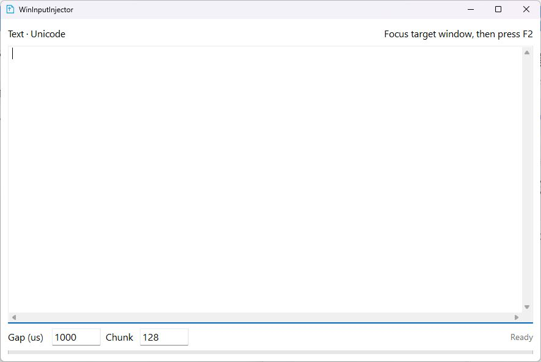

# WinInputInjector

  

[English](#english) | [中文](#中文)

---

## English

**WinInputInjector** is a lightweight Windows application built with C++ and Win32 API that allows you to inject text (Unicode characters) into applications that block standard copy-pasting or input methods (e.g., certain games, restricted web pages, or virtual machines).

### Features
* **Unicode Text Injection:** Sends text natively via Windows Input Simulator APIs (`SendInput`).
* **Adjustable Interval:** Control injection speed with a microsecond gap between chunks and an adjustable chunk size (1-32768 characters, default 128).
* **Global Hotkey:** Press **F2** to quickly trigger the text injection.
* **Progress Tracking:** Built-in progress bar to monitor injection status in real-time.
* **Low Latency Keyboard Hook:** Catches hotkeys globally across the system without delay.

### How to Use
1. Run the application.
2. Type or paste the text you want to inject into the text box.
3. Unicode input is used automatically. **F2 is the only injection trigger**; there is no send button.
4. **Gap (us)** defaults to `1000` (1 ms), and **Chunk** defaults to `128` characters (range `1-32768`). If the target drops or scrambles characters, reduce the chunk size or increase the gap, e.g. to `10000` (10 ms). Set the gap to `0` for one-batch, unthrottled injection; chunk size is disabled and ignored, with its value retained.
5. Switch to the target application (game or website) and select the input field.
6. Press **F2** to start the injection. Repeated F2 presses while sending do not start another task.

The input starts empty. Tab cycles through text, gap, and chunk (skipping chunk at gap 0); Shift+Tab moves backwards. Enter in the text area inserts a newline. To clear the text, focus the text area and press Ctrl+A, then Delete. The native layout scales with display DPI. A short status appears beside the parameters, above a thin progress bar; only failures expand a two-line detail area. Hover over parameters for their ranges and behavior, or over the status for the full result. The latest result remains until the next F2 run.

### Input Limit
The text box accepts up to **100,000 UTF-16 code units**, including line breaks. Common Chinese characters and English letters each count as one unit; some emoji count as two or more units. Text typed or pasted beyond the limit will not be fully accepted; check the contents before injection.

Large texts may cause delays when pasting, editing, or processing input in the target application. An interval of `0` sends all input events in one batch, with the progress bar updating only when injection finishes; this does not guarantee that the target application has finished processing the text.

The first chunk is sent immediately. Positive intervals wait after each chunk completes, without catch-up bursts. A valid UTF-16 surrogate pair (such as many emoji) counts as one character and is sent together; each other UTF-16 unit counts as one. Spaces, tabs, CR, and LF are sent unchanged. Multi-code-point emoji can count as multiple characters. Chunk size 1 restores per-character pacing. Empty or invalid chunk values revert to 128; out-of-range values are clamped to 1-32768 on focus loss or F2 startup. Settings are captured at task start, so later edits apply to the next task; settings are not persisted after exit. The maximum is a selectable limit, not a guarantee of target capacity. The requested delay is not an exact timing guarantee; Windows scheduling can make it longer, and 1 ms may still be too fast for some editors. Newline characters are sent unchanged and may be handled differently by different editors.

Status captions are `Ready`, `No text`, `Sending · N%`, `Sent to Windows`, `Failed · N%`, or `Cancelled · N%`. A zero or partial `SendInput` result stops the task without retrying; progress counts only fully sent characters (measured in UTF-16 units, excluding incomplete surrogate pairs), and failures do not show 100%. Expanded failure details include the completed position, last call's sent/requested event counts, and any Windows error code. Completion means events were sent to Windows, **not that the target text was verified**. Closing the app cancels remaining paced input; an already submitted batch cannot be recalled.

---

## 中文

**WinInputInjector** 是一个使用 C++ 和 Win32 API 编写的轻量级 Windows 应用程序，允许您将文本（Unicode 字符）直接注入到那些禁止标准复制粘贴或屏蔽输入法的应用程序中（例如：某些游戏、受限网页或虚拟机）。

### 功能特点
* **Unicode 文本注入：** 通过 Windows 原生输入模拟 API (`SendInput`) 发送文本。
* **自定义间隔时间：** 可设置批间微秒级间隔和每批字符数（1～32768，默认 128），控制发送速度。
* **全局快捷键：** 按下 **F2** 即可快速触发注入（支持后台生效）。
* **进度追踪：** 内置进度条，实时监控当前文本的注入进度。
* **低延迟键盘钩子：** 无延迟捕获系统全局快捷键。

### 使用方法
1. 运行应用程序。
2. 在文本框中输入或粘贴您想要注入的文字。
3. 自动使用 Unicode 输入模式。**F2 是唯一发送入口**，界面不再提供发送按钮。
4. **Gap (us)（批间间隔微秒）** 默认为 `1000`（1 毫秒），**Chunk（每批字符数）** 默认为 `128`，范围为 `1～32768`。如果目标程序出现丢字或错乱，可减小 chunk 或增大间隔，例如改为 `10000`（10 毫秒）。间隔设为 `0` 时不节流、单次发送全文，chunk 输入框禁用且设置被忽略，但保留其值。
5. 切换到目标应用程序（游戏或网页），并选中想要输入文字的输入框。
6. 按下键盘上的 **F2** 键开始注入；发送过程中再次按 F2 不会启动新任务。

输入框初始为空。Tab 按文本、间隔、chunk 的顺序循环切换焦点（间隔为 0 时跳过 chunk），Shift+Tab 反向切换。文本框中 Enter 插入换行；需要清空时，在文本框中按 Ctrl+A，再按 Delete。原生布局随显示 DPI 缩放，参数右侧显示简短状态，下方为细进度条；只有失败时展开两行详情。悬停参数可查看范围与行为，悬停状态可查看完整结果。最近一次结果保留到下次 F2 启动。

### 输入限制
文本框最多接受 **100,000 个 UTF-16 代码单元**，换行也计入限制。常见汉字和英文字母各占 1 个单元，部分 emoji 占 2 个或更多单元。超过上限的输入或粘贴内容无法完整保留，请在发送前检查文本。

大文本在粘贴、编辑或目标程序处理输入时可能出现延迟。间隔设为 `0` 时会一次性发送全部输入事件，进度条仅在注入结束时更新；这不保证目标程序已经处理完全部文字。

首批立即发送，正间隔从每批发送完成后开始等待，不会追赶补发。合法 UTF-16 代理对（例如许多 emoji）按一个字符计数并整组发送，其他 UTF-16 单元各算一个；空格、Tab、CR、LF 均原样发送。由多个码点组成的 emoji 可能算多个字符。chunk 设为 1 可恢复逐字符限速。空值或非法值在失焦或按 F2 启动时恢复 128，越界值限制到 1～32768。启动时固定本次任务参数，运行中修改仅影响下次任务；退出后不保存设置。上限仅代表允许选择的范围，不保证目标编辑器能及时处理。间隔是请求的等待时间，Windows 调度可能使实际等待更长；1 毫秒仍可能超过某些编辑器的处理能力。换行字符保持原样发送，不同编辑器可能有不同的处理结果。

状态显示为 `Ready`、`No text`、`Sending · N%`、`Sent to Windows`、`Failed · N%` 或 `Cancelled · N%`。`SendInput` 零发送或部分发送时立即停止，不自动重试；进度只计入完整发送的字符（以 UTF-16 单元计数，不包含未完整发送的代理对），失败不会显示 100%。展开的失败详情包含已完成的位置、最后一次调用的实际/请求事件数和可用的 Windows 错误码。完成仅代表事件已发送给 Windows，**不代表目标文本已核对正确**。关闭程序会取消剩余的限速发送；已提交的整批事件无法撤回。

---

## Build / 编译
- Requirements / 环境要求: **Visual Studio** with the **Desktop development with C++** workload, **MSVC v145**, and a **Windows 10/11 SDK**.
- C++ Standard / 语言标准: **C++20** (for concepts and `<stop_token>`).
- Platform / 平台: **x64 only / 仅支持 x64**; Debug and Release configurations are available. 32-bit and WOW64 targets are not supported.
- Dependency / 依赖: **Boost** headers, including `<boost/lockfree/spsc_queue.hpp>`. Add the Boost root directory to the compiler's include paths; no compiled Boost library is required. 将 Boost 根目录加入编译器包含路径，无需链接 Boost 二进制库。
- Build / 构建: Open `WinInputInjector.slnx` in Visual Studio and build **Debug | x64** or **Release | x64**. 打开解决方案并选择对应的 x64 配置构建。
- Validation / 验证: See [x64 injection checks](tests/README.md) for automated tests and the offline browser fixture. 自动化测试与离线浏览器测试页见该说明。
